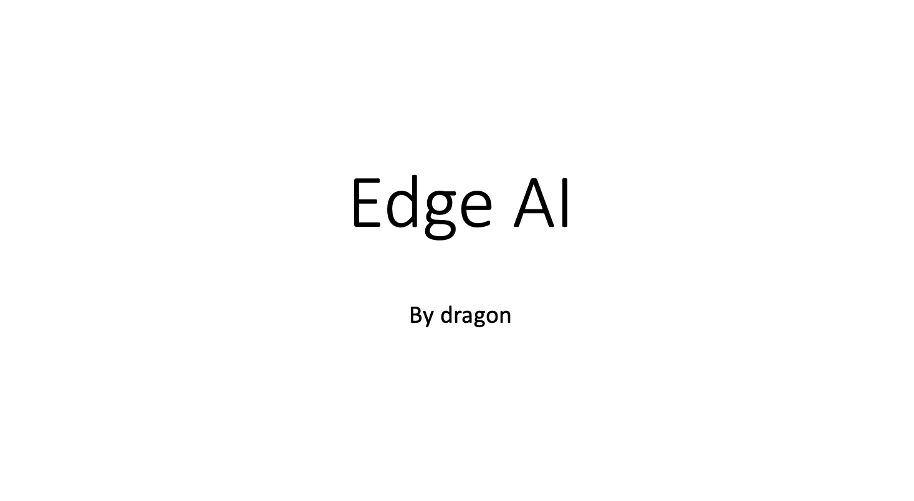
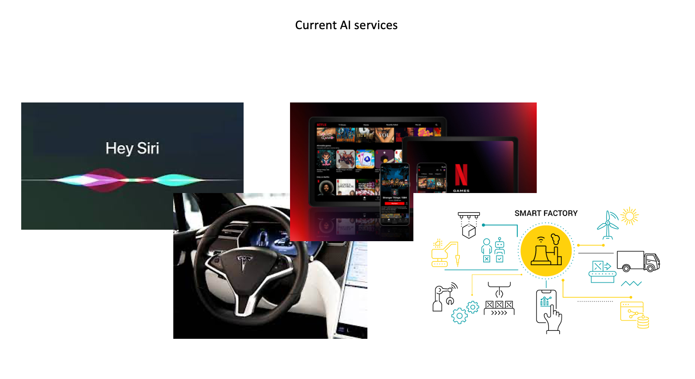
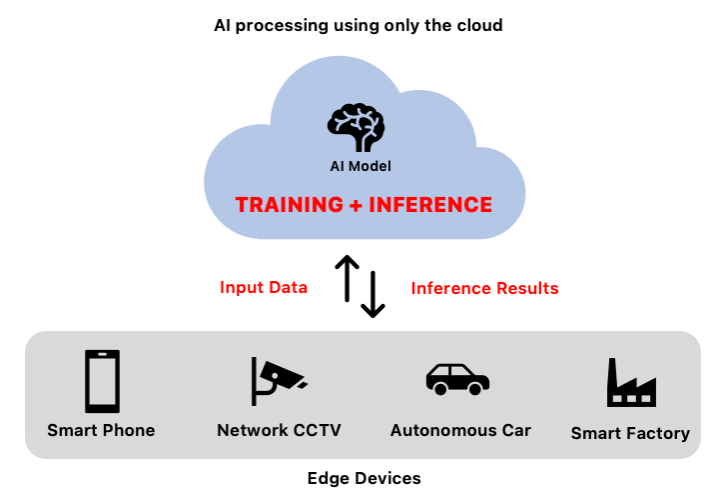
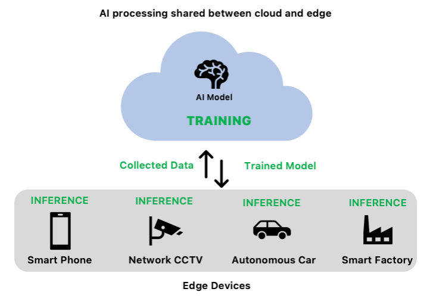
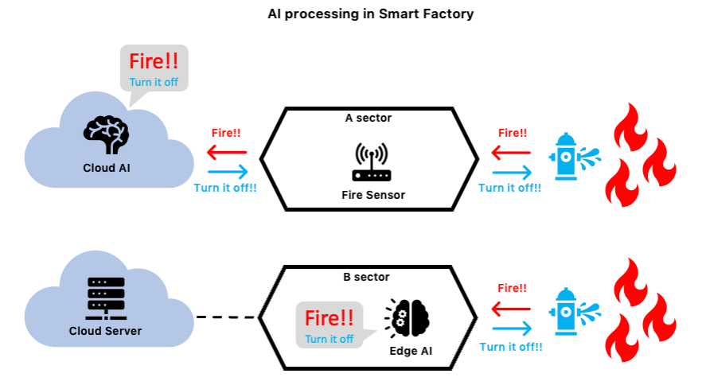
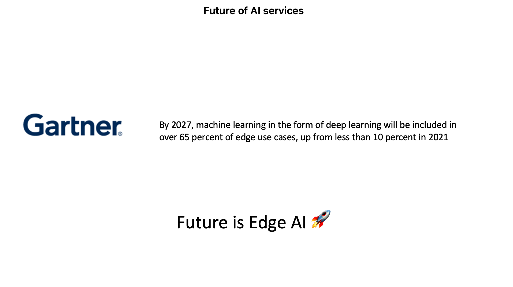

# Edge AI

Today, I will talk about EdgeAI.

In the last presentation, I told you that AI model compression is an important technology to reach Edge AI.

First, I will tell you about the current AI services.

With the development of AI technology, AI services can be found around as.

Apple's Siri, Tesla's self-driving car, Netflix's movie recommendation system, smart factory, AI control system, etc.

Most of these AI services use Cloud AI.

In the near future, Cloud AI will be replaced by Edge AI.

Because there are some limitations of Cloud AI.

So, what is Cloud AI.

Cloud AI means an AI service in which an AI model is located on a cloud server.

Edge devices transmit real-time data to the cloud server and receive predictive results from AI models located on the cloud server.

Cloud services have advantages such as 

scalability, elasticity, and high availability,

스칼러빌리티 일래스티서티 앤드 하이 어베일러빌러티

 so many companies are applying the cloud to AI services.

However, cloud AI has some limitations, such as network latency, network dependence, and communication security issues.

Next, what is Edge AI.

Edge AI has emerged to improve the limitations of cloud AI.

Edge AI means an AI service in which an AI model is located on an edge device.

**Unlike conventional cloud AI methods, edge devices directly inference.**

By directly inferring and outputting data collected from edge devices,

we can overcome the limitations of cloud AI such as network latency, network dependence, and communication security issues.

SO, What is the difference between cloud AI and edge AI?

The example is how AI services work in the smart factory.

In the event of a fire, cloud AI operates in the order of fire occurrence → fire detection (edge device) → fire judgment (cloud AI) → fire extinguishing(익스팅귀슁) instruction (cloud AI) → fire extinguishing instruction (edge device) → fire suppression.

Each stage consists of a network, and if a network failure occurs at the moment of a fire, the fire suppression may be delayed or the fire suppression may fail. 

This is because output values cannot be obtained from AI models located in the cloud.

On the other hand, when a fire occurs in an edge AI environment, it operates in the order of fire occurrence → fire detection, judgment, fire extinguishment (edge device) → fire suppression. It's simpler than cloud AI and less network-dependent, so you can put out fires much more effectively.

finally, What is the future of AI services?

According to the Gartner report, "By 2027, machine learning in the form of deep learning will be included in over 65 percent of edge use cases, up from less than 10 percent in 2021.

Currently, it is difficult to apply Edge AI due to the limited performance of edge devices and the large amount of computation of AI model, but it will be found with us in the near future.